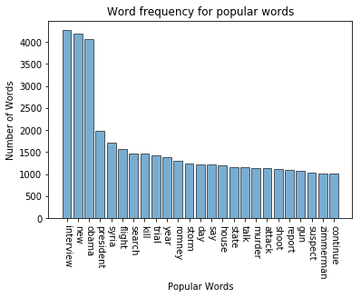
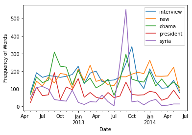

# CNN_News

## Figure 1
Frequency of 25 most popular words that existed in the CNN news' titles from 2012.5-2014.6.

## Figure 2
The trend of the most popular 5 words from 2012.5-2014.6.

Word "obama" and "syria" show similar trend

